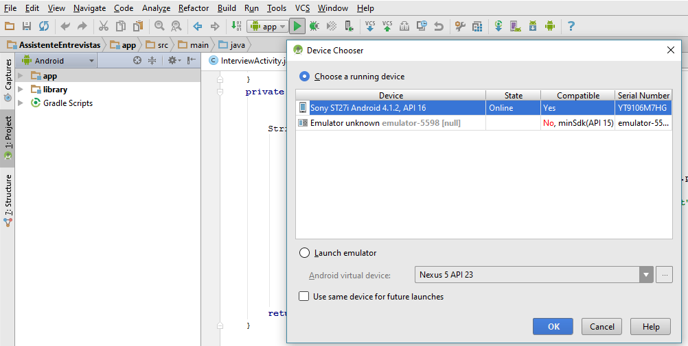

#Assistente de Entrevistas

##Sinopse
Esta aplicação para dispositivos Android permite assistir a realização de entrevistas desde o momento em que é planeada, executada até à sua submição num serviço web. Com este tipo de acompanhamento ao longo de todo o processo de concretização das entrevistas, pretendemos aumentar a qualidade dos dados recolhidos, juntando metainformação que posssa ser útil para um melhor aproveitamento do material recolhido.

##Instalação
Para instalar a aplicação num dispositivo android é necessário o Android Studio ou apenas com Android SDK.Ambos podem ser descarregados no link que se segue.

https://developer.android.com/studio/index.html

Activar ao modo programador no dispositivo Android.

https://developer.android.com/studio/run/device.html

###Android Studio
Utilizando o botão 'play' do menu é possivel instalar o .apk no dispositivo selecionado.


###Android SDK(Linha de comandos)
Tendo apenas o Android SDK instalado e o ficheiro .apk da aplicação podemos utilizar o comando '$adb' (Android Debug Bridge) para instalar a aplicação.

#####É necessário descarregar o pacote Platform-tools através do android-sdk.
```{r, engine='bash'}
android list sdk -u
```
Isto vai listar os pacotes disponiveis para download.
```
Packages available for installation or update: 11
   1- Android SDK Platform-tools, revision 24
   2- Android SDK Build-tools, revision 24
   3- Documentation for Android SDK, API 23, revision 1
   4- SDK Platform Android N, API 24, revision 1
   5- GPU Debugging tools, revision 3.1
   6- GPU Debugging tools, revision 1.0.3
   7- Android Support Repository, revision 33
   8- Android Auto Desktop Head Unit emulator, revision 1.1
   9- Google Play services, revision 30
  10- Google Play APK Expansion library, revision 1
  11- Google Play Licensing Library, revision 1
```
E indicamos apenas os pacotes que pretendemos instalar.
```{r, engine='bash'}
android update sdk -u -t 1,2
```

Em alternativa podemos usar o comando que se segue e instalar tudo.
```{r, engine='bash'}
android update sdk -u
```


##Diagrama de classes (.SVG)
2 de Julho de 2016

